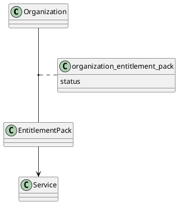
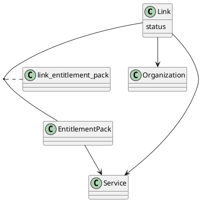

# HEXAA migrator

# Table of Contents

- [HEXAA migrator](#hexaa-migrator)
- [Table of Contents](#table-of-contents)
    - [Usage](#usage)
        - [Creating databases](#creating-databases)
        - [Dependencies](#dependencies)
        - [Arguments](#arguments)
    - [Details](#details)
        - [Entitlement URI update](#entitlement-uri-update)
        - [Link transformation](#link-transformation)

## Usage

The scripts moves data from one MySQL/Maria DB to another.

### Creating databases

If you want to migrate from an SQL dump, import it into a DB first:

```sql
CREATE DATABASE hexaa_dump;
GRANT ALL PRIVILEGES ON `hexaa_dump`.* TO 'hexaa'@'%'
```

```bash
mysql --host 127.0.0.1 -u hexaa -p$MYSQL_PASSWORD hexaa_dump < hexaadump_2019-03-04.sql
```

You need to prepare the schema in the target DB. You can achieve this by running `php app/console doctrine:schema:create` in the **new (version 2)** HEXAA, or manually running the schema creation script in this repo:

```bash
mysql --host 127.0.0.1 -u hexaa -p$MYSQL_PASSWORD hexaa < hexaa_schema_new.sql
```


### Dependencies

To install dependencies, run this command:

```bash
pip3 install -r requirements.txt
```

### Arguments

You need to specify the source and target DB connection params:

```
  --old-host OLD_HOST, -oh OLD_HOST
                        Address of old DB (default: 127.0.0.1).
  --old-port OLD_PORT, -opo OLD_PORT
                        Port old DB (default: 3306)
  --old-user OLD_USER, -ou OLD_USER
                        User for old DB.
  --old-passwd OLD_PASSWD, -opw OLD_PASSWD
                        Password for old DB.
  --old-db OLD_DB, -od OLD_DB
                        Database name for old DB.

  --new-host NEW_HOST, -nh NEW_HOST
                        Address of new DB. (default: 127.0.0.1).
  --new-port NEW_PORT, -npo NEW_PORT
                        Port new DB (default: 3306).
  --new-user NEW_USER, -nu NEW_USER
                        User for new DB.
  --new-passwd NEW_PASSWD, -npw NEW_PASSWD
                        Password for new DB.
  --new-db NEW_DB, -nd NEW_DB
                        Database name for new DB.
```

If you want to change the prefix of entitlement URI's:

```
  --old-prefix OLD_PREFIX
                        Old entitlement URI prefix to be replaced.
  --new-prefix NEW_PREFIX
                        New entitlement URI prefix.
```

Example:

```bash
./migrator.py \
    -ou hexaa -opw hexaa -od hexaa_dump \
    -nu hexaa -npw hexaa -nd hexaa \
    --old-prefix 'urn:geant:niif.hu:hexaa' \
    --new-prefix 'urn:geant:hexaa.eu:hexaa'
```

## Details


### Entitlement URI update

If you specify it in the CLI arguments, the script will update the URI
prefix of entitlements. URI's that don't start with the old prefix will
be copied unchanged.


### Link transformation


Old schema:



New schema:



**Note**: The (`organization_id`,`service_id`) foreign key pair is a unique key in the Link table
