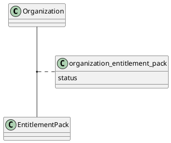
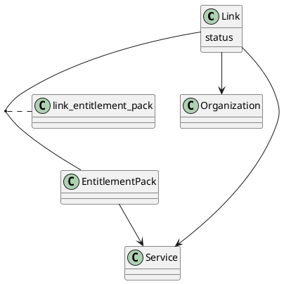

# hexaa-migrator

hexaa migrator


## Creating new target database

```sql
CREATE DATABASE hexaa_new;
GRANT ALL PRIVILEGES ON `hexaa_new`.* TO 'hexaa'@'%'
```

## Link transformation


Old schema:



New schema:



**Note**:   The (`organization_id`,`service_id`) foreign key pair is a unique key in the Link table